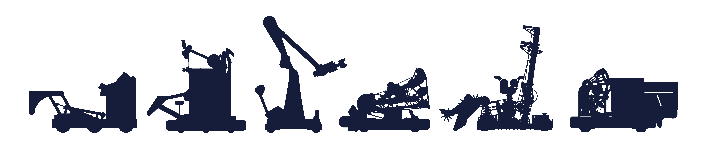

  

## Sobre o Projeto

O objetivo deste GitHub é fornecer repositórios, documentações e exemplos práticos que auxiliem na compreensão, aprendizado e nivelamento técnico entre os times de FRC. A proposta é garantir que todas as equipes tenham acesso ao mesmo conhecimento, apoio e oportunidades de desenvolvimento, independentemente de sua experiência ou estrutura atual.

Embora o foco principal esteja voltado para programação e desenvolvimento de software, este repositório não se limita apenas a essa área. Todo conteúdo que possa contribuir para a evolução e padronização do ensino entre os times será disponibilizado aqui, incluindo materiais relacionados a CAD, elétrica, estratégia, simulação, visão computacional, controle, automação e demais áreas da robótica competitiva.

Nosso objetivo é fortalecer a comunidade através do compartilhamento de conhecimento, promovendo colaboração, aprendizado aberto e crescimento coletivo entre as equipes.

## Teams

<picture>
  <source media="(prefers-color-scheme: dark)" srcset="robots-dark.png">
  <source media="(prefers-color-scheme: light)" srcset="robots-light.png">
  
</picture>
